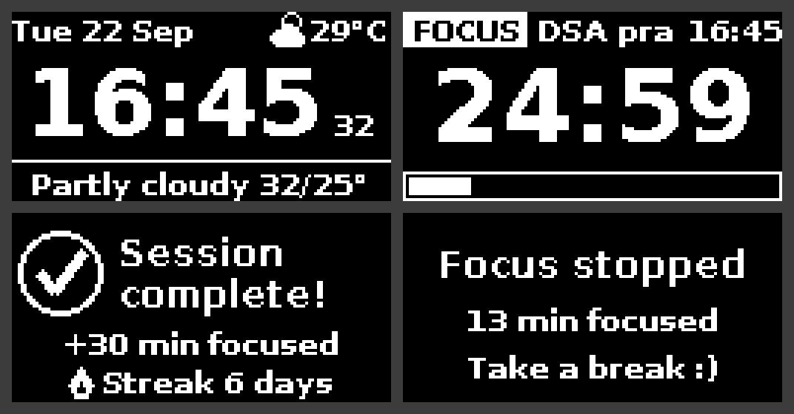

# OLED Pinout (I2C, 128x64 SH1106 / SSD1306)

FocusPi uses a standard 4-pin I2C OLED module.

## Connections

| OLED pin | Raspberry Pi pin | Pi function     | Wire colour (suggestion) |
|----------|------------------|-----------------|--------------------------|
| **VCC**  | **Pin 1**        | 3.3V power      | Red                      |
| **GND**  | **Pin 9** (or 6) | Ground          | Black                    |
| **SCL**  | **Pin 5**        | GPIO3 / I2C SCL | Yellow                   |
| **SDA**  | **Pin 3**        | GPIO2 / I2C SDA | Blue / Green             |

```
  Raspberry Pi 40-pin header, top view, rotated so pin 1 is at the top-left:

                         +-----+-----+
     OLED VCC  ───────── | 1 ● | ● 2 |   5V
     OLED SDA  ───────── | 3 ● | ● 4 |   5V
     OLED SCL  ───────── | 5 ● | ● 6 |   GND   (also OK for OLED GND)
                         | 7 ● | ● 8 |   GPIO14
     OLED GND  ───────── | 9 ● | ● 10|   GPIO15
                         | ... | ... |
                         +-----+-----+
    Pin 1 has the square solder pad and sits at the end of the header
    farthest from the USB / Ethernet ports. Odd pins = inner row.


        ┌──────────────────────────┐
        │  GND  VCC  SCL  SDA      │   <- check YOUR module's silk-screen:
        │   ●    ●    ●    ●       │      many modules print GND first,
        │ ┌──────────────────────┐ │      some print VCC first.
        │ │      128 x 64        │ │      Always wire by the LABEL,
        │ │        OLED          │ │      not by position.
        │ └──────────────────────┘ │
        └──────────────────────────┘
```

## Notes

- **Use 3.3V (pin 1), not 5V.** Most modules accept 5V on VCC, but their pull-ups
  then drive SDA/SCL at 5V, and the Pi's GPIO pins only tolerate 3.3V.
- **Driver:** most 1.3" modules use **SH1106**, most 0.96" use **SSD1306**. If the
  picture looks shifted by 2 pixels or shows noise on the right edge, switch
  `FOCUS_OLED_DRIVER` in `pi/focuspi.env`, then run `bash deploy.sh restart`.
- **I2C address:** usually `0x3C`, sometimes `0x3D`. Check it with:

  ```bash
  sudo i2cdetect -y 1
  ```

  You should see `3c` (or `3d`) in the grid. Set `FOCUS_I2C_ADDR` to match.
- **Screen upside down?** Set `FOCUS_OLED_ROTATE=2`.
- **Only one program can drive the screen.** If another service on the Pi already uses
  the same OLED, stop it first (`sudo systemctl disable --now <that-service>`).

## What the screen shows



1. **Clock** (idle): date and weather on top, big time with seconds, and a bottom line
   that rotates through weather details, humidity/wind, and streak + minutes today.
   The layout shifts by 1px every minute to reduce OLED burn-in. Brightness and night
   dimming (23:00 to 06:00) are set from the app's Settings tab.
2. **Focus**: `FOCUS` badge, your label, the wall clock, a big countdown and a progress bar.
3. **Session complete** (20 s after finishing): minutes added and your new streak.
4. **Focus stopped** (5 s after stopping early).
